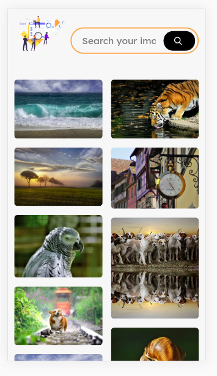

# 🔥 Awesome Pixabay webapp
Vanilla version release 🍦
You can use the app here: [GO!](https://awesome-pixabay-rh6sujghb.now.sh/)

####Description:
It is a minimalist search engine that offers results consuming the Pixabay API. This project was created with the technology of Next.js and React.js.

###How does it work?
Requires Node.js v10

###Scripts:
1.-`npm install` to install all dependencies.

2.-`npm run dev` to run the server on development enviroment.

3.-`npm run build && npm run start` to run the server on production enviroment.

####Licence
  MIT
